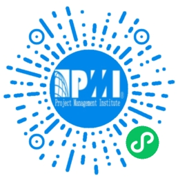

### 项目管理知识体系梳理

本系列文档主要基于 PMBOK（第6版）进行梳理，知识体系涵盖了 PMBOK 所有核心知识点，同时也会结合自己在 PMP 考试中获得 5A 的学习过程中的总结，让接触该内容的读者更容易理解和接收。

 整个知识体系会围绕下图进行展开：

横向按照项目生命周期分成 5 大过程组，纵向列出了在项目全生命周期管理过程中所需要掌握的 10 大知识领域的内容。这样横纵交错可以很清晰的看到我们在项目的不同阶段需要使用关注和使用哪些知识领域的内容来进行项目的管理。

|       | 启动过程组   | 规划过程组     |   执行过程组   |  监控过程组    |  收尾过程组    |
| ---------------- | :-------: | ---- | ---- | ---- | ---- |
| 项目整合管理   | * 制定项目章程 | * 制定项目管理计划 | * 指导和管理项目工作 | * 监控项目工作  * 实施整体变更控制 |   * 结束项目或阶段   |
| 项目范围管理   |     |  * 规划范围管理  * 搜集需求  * 定义范围  * 创建WBS    |      |  * 确认范围  * 控制范围    |      |
| 项目时间管理   |           | * 规划进度管理  * 定义活动  * 排列活动顺序  * 估算活动资源  * 估算活动持续时间  * 制定进度计划 |      | * 控制进度 |      |
| 项目成本管理     |           | * 规划成本管理  * 估算成本  * 制定预算 |      | * 控制成本 |      |
| 项目质量管理     |           | * 制定质量管理 | * 实施质量保证 | * 控制质量 |      |
| 项目人力资源管理 |           | * 规划人力资源管理 | * 组建项目团队  * 建设项目团队  * 管理项目团队 |      |      |
| 项目沟通管理     |           | * 规划沟通管理 | * 管理沟通 | * 控制沟通 |      |
| 项目风险管理     |           | * 规划风险管理  * 识别风险 * 实施定性风险分析  * 实施定量风险分析 * 规划风险应对 |      | * 控制风险 |      |
| 项目采购管理     |           | * 规划采购管理 | * 实施采购 | * 控制采购 | * 结束采购 |
| 项目干系人管理     | * 识别干系人 | * 规划干系人管理 | * 管理干系人参与 | * 控制干系人参与 |      |

#### PMP 考试助手（微信小程序）

